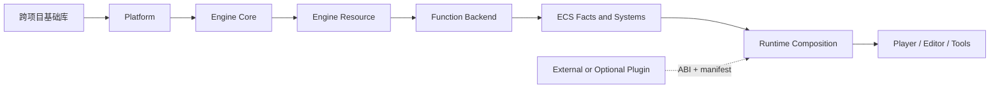
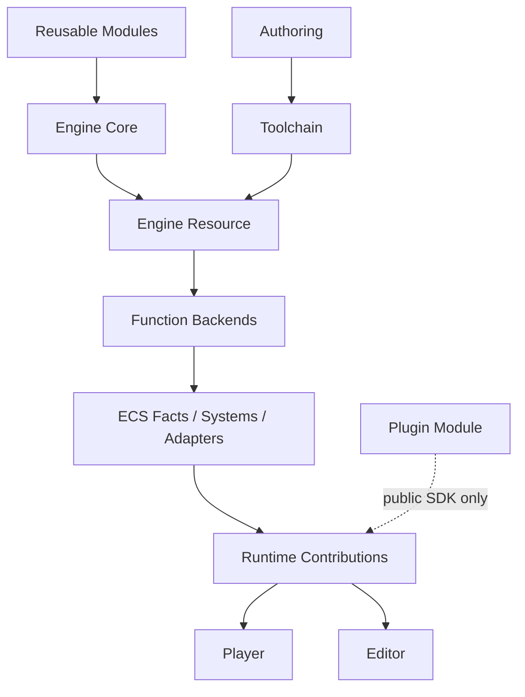

# lux-engine 模块、插件与工程边界审计

> 状态：架构建议稿，不是当前实现承诺。
>
> 范围：`lux-engine` 的 `modules/`、`ecs/`、`engine/`、`extensions/`、宿主与
> 安装产品边界。
>
> 文档职责：只维护 lux-engine 内部的目录、Target、运行期装配与产品边界。
>
> 跨项目 C++ 基础语义、API 设计、质量门禁和迁移计划已独立到
> [lux-cxx 改进建议与跨项目基础语义迁移计划](lux-cxx-improvement-proposal.zh-CN.md)。
> 本文不再重复该方案。

## 1. 执行摘要

当前目录表达了大致正确的分层意图，但目录名、CMake target、安装产品和运行期装配
仍有几处不一致。最重要的结论如下。

1. `extensions/` 当前确实有运行期价值，但它应该只存放可由外部部署、manifest 选择、
   ABI 校验并通过 `ModuleLease` 固定代码寿命的叶节点产品。引擎内建能力不应因为
   “可选”就自动叫 Extension。
2. `modules/` 不应表示“引擎里比较底层的代码”。它应表示能脱离 Scene、Entity、Asset、
   Render Feature、Editor、Host 等引擎语义，被同级外部项目独立消费的库产品。
3. `engine/` 应承载 composition、Runtime、Host、Toolchain、Authoring 和 Editor 语义；
   `ecs/` 应承载组件事实、系统与 `modules` 能力之间的引擎连接层，而不是第三方 backend
   实现或通用基础容器。
4. 当前最严重的边界问题不是文件放错一层，而是一个 target 同时承担通用机制和引擎
   policy。例如 reflection metadata 与 ECS/Render 注解混合、resource codec 与 engine
   资产类型混合、render client 与具体 Scene Feature 混合。
5. 持久格式写入编译器生成的 `type_hash` 是独立的 P0 数据兼容问题。它必须改成稳定
   schema identity；具体基础类型设计归独立基础库文档负责。

目标依赖应保持：



关键限制是：`Runtime` 可以发现并加载 Plugin，但引擎 production target 不反向链接
`extensions/*`；插件也不能成为引擎底座的隐式依赖。

---

## 2. 术语与审计判据

### 2.1 Module

Module 是构建与复用单元。它回答：

- 这个能力能否被外部项目独立 `find_package`；
- public header 是否只使用领域中立词汇；
- 是否有明确的安装组件和依赖闭包；
- 是否能在不链接 lux-engine Runtime、Editor、Host 的情况下测试。

Module 不等于动态库，也不等于运行期可开关功能。

### 2.2 Contribution

Contribution 是运行期装配单元。它声明：

- 要安装哪些 ECS system；
- 提供和要求哪些 SceneService；
- 依赖哪些其他 contribution；
- 是否允许动态启用和移除；
- 如何持久化 activation。

它可以由内建代码注册，也可以由外部模块注册。Contribution 本身不是插件。

### 2.3 Plugin

Plugin 是可部署产品。它必须具有：

- 独立二进制或 owning image 来源；
- 稳定模块 ID、版本和 ABI fingerprint；
- 依赖声明与完整预验证；
- registrar transaction；
- `ModuleLease` 代码寿命；
- manifest 或用户显式选择；
- 失败时不发布半个 catalog。

### 2.4 Extension

Extension 是能力关系：它扩展既有宿主。为了避免“扩展”既指 ABI 模块又指普通可选
功能，建议代码和文档使用更精确的词：

- 二进制产品：Plugin Module；
- 场景装配：Contribution；
- Render 动态能力：Render Effect；
- Editor 扩展：Editor Tool；
- 用户配置：Activation。

### 2.5 一个库是否属于 modules

只有同时满足下列条件，才适合进入 `modules/`：

1. public API 不要求 Scene、Entity、Component、Asset、Pak、Editor 或 Host 概念；
2. 可被至少一个非引擎 consumer 独立使用；
3. 测试不反向链接 Runtime、Toolchain、Editor；
4. 不依赖引擎全局 catalog、singleton 或 composition root；
5. 错误通过 value、callback 或窄 sink 返回，不决定宿主输出位置；
6. 安装 target 的名字、namespace 与职责一致。

“算法很通用”不够。如果输入输出仍是引擎领域对象，它依然属于 engine adapter。

---

## 3. `extensions/` 的现状与目标

### 3.1 当前真实用途

`extensions/` 已具备可运行的模块装载链，而不是空目录：

- `ExtensionModuleManager` 负责动态库或 image 验证；
- ABI descriptor 复制后进入主线程 transaction；
- reflection 与多个 catalog 使用 draft/commit 边界；
- module dependency 和 readiness 有验证；
- `ModuleLease` 固定注册代码寿命；
- manifest 决定部署与运行期选择。

因此不应该删除插件能力。问题在于目录中的产品命名容易让“官方内建功能”与“外部注入
模块”混为一谈。

### 3.2 推荐目录语义

```text
extensions/
  sdk/                    外部插件 SDK、descriptor、registration facade
  official/               官方发布、但不属于核心运行时闭包的插件
  samples/                示例插件，只用于文档和 ABI 验证
  test_modules/           rollback、依赖、ABI、动态组件测试夹具
```

不建议把所有官方可选功能都搬进 `extensions/official`。进入该目录必须满足：

- 引擎 target 不链接它；
- 删除插件文件后基础 Player 仍能启动；
- manifest 缺失时结构化报告能力不可用；
- 插件通过公开 SDK 注册，不 include Runtime 私有头；
- 有真实独立模块测试，不靠静态链接伪装加载。

### 3.3 Physics2D 的两种合法选择

Physics2D 当前最能说明命名问题。它可以选择两条路径，但不能同时保持模糊状态。

#### 路径 A：引擎内建领域能力

如果 Player、Editor、示例场景默认依赖 Physics2D，则：

- backend 位于 `modules/function/physics2d` 或明确的 backend product；
- ECS 事实和系统位于 `ecs/physics2d`；
- scene contribution 位于 `engine/runtime/packs/physics2d`；
- Host 在 composition root 注册；
- 不通过 Extension ABI 绕一圈。

#### 路径 B：官方插件

如果 Physics2D 是可替换、可不部署的产品，则：

- 引擎只保留领域中立 collision/physics contract；
- `extensions/official/physics2d` 只通过 Plugin SDK 注册 contribution；
- 基础 Player 不链接其 target；
- `.luxpak` 或 launch manifest 显式声明模块；
- 无插件时 2D Scene 仍能无物理启动，而不是链接或 service lookup 崩溃。

### 3.4 适合插件化的候选

优先候选包括：

- 厂商特定渲染效果与 upscale backend；
- 外部格式 importer/exporter；
- Editor panel/tool；
- 可替换脚本语言；
- 外部遥测、诊断 sink；
- 机器人或仿真桥接；
- 非核心 navigation/physics backend；
- 项目自定义组件 schema 与 contribution。

共同特点是：它们是叶节点，能够通过现有 SDK 窄面注册，不要求引擎底座反向知道具体
类型。

### 3.5 不应插件化的内容

以下能力应保持内建基础设施：

- `AsyncRuntime` 和主线程 mailbox；
- `Schedule`、EntityRegistry 与唯一 ECS command barrier；
- SceneRuntime 生命周期；
- Asset/Content 基础读取契约；
- Render client/control/upload 的基础通道；
- Extension loader 自身；
- Plugin SDK 与 ABI validation；
- 日志/诊断出口装配。

把 loader 自己做成插件、把 Schedule 做成插件，都会制造先有鸡还是先有蛋的启动闭环。

### 3.6 ABI 最小表面

公开 ABI 应尽量只包含：

- 固定宽度整数与明确 layout 的 POD；
- pointer + size view；
- 函数表和 opaque handle；
- 显式 allocator/ownership；
- ABI version、compiler/CRT/stdlib fingerprint；
- 明确的 shutdown 和 lease 规则。

不应跨未知模块边界直接传递：

- `std::string`、`std::vector`、`std::shared_ptr`；
- EnTT registry 或 component pool；
- Runtime private class；
- 异常；
- 借用但没有 lifespan 的 span；
- 编译器 type name/hash 作为持久或 ABI 身份。

---

## 4. `modules`、`engine` 与 `ecs` 的边界

### 4.1 目标职责

#### modules

可被同级项目复用的库产品。它可以有复杂算法和独立资源格式，但不能要求 lux-engine 的
Scene/Host/Editor composition。

#### ecs

引擎 ECS 连接层：

- authored facts；
- derived cache 与 transient binding；
- observer/deferred command system；
- 从 ECS facts 调用 module/backend 的 adapter；
- reflection sidecar 与 component schema。

#### engine

产品语义与 composition：

- Authoring、Toolchain、Runtime、Packs；
- Asset/Pak/Scene 生命周期；
- Editor 和 Player；
- host-specific service assembly；
- 插件加载和 activation。

### 4.2 已经正确的依赖方向

当前树已经有若干值得保留的正确方向：

- Runtime 不链接 Toolchain/Editor；
- Authoring → Toolchain → Runtime cooked 的总体方向明确；
- Render 已拆分 client/graph/vulkan/features；
- ECS 组件与系统大体分离；
- Scene contribution 已从万能 Scene3D 描述符向领域正交 descriptor 拆分；
- EntityScene/LXSC/LXES 已替代旧 World cooked 总线；
- Player 主要消费 cooked Pak，而不是 Authoring 文档。

后续迁移应围绕这些主干收敛，不应重建 World、FeatureBundle 或 Host-owned parallel registry。

### 4.3 P0：reflection target 混合通用 metadata 与引擎 policy

`modules/core/meta` 同时承担：

- 通用 class/field/enum metadata；
- 编译期类型描述；
- ECS component schema；
- EntityScene relocation annotation；
- Render/Asset 相关生成规则；
- generator build glue。

这违反了 `modules` 的独立消费目标。正确拆法是三层：

```text
reflection-metadata/       领域中立 metadata IR 与查询
ecs-reflection-adapter/    Component schema、serialization policy、sidecar
engine-schema-policy/      Asset、EntityScene relocation、Render/Editor annotation
```

验收标准：通用 metadata public header 不出现 EnTT、Component、EntityScene、Asset、Render；
ECS adapter 单独链接；生成器从稳定 metadata IR 读取，而不是内置所有引擎政策。

### 4.4 P0：持久文件写入 compiler `type_hash`

FlowGraph 等持久格式仍存在直接写入编译器类型 hash 的路径。编译器生成的类型名和 hash
只适用于单进程注册表，不能承诺：

- MSVC/GCC/Clang 一致；
- 工具链升级一致；
- Debug/Release 一致；
- Windows/Android 一致；
- 类型重命名后可迁移。

最小修复是为 wire schema 定义 canonical stable name、显式 version 和迁移路径，升级格式，
并加入禁止 `type_hash/type_name` 进入 encoder 的静态门禁。身份原语的完整设计见本文开头
链接的专项文档。

### 4.5 P1：serialization 混入 engine cooked 策略

通用 binary reader/writer、endian、varint、bounded count 与具体 cooked policy 应拆开。
当前 TaggedProperty/NameTable/relocation 代码容易把以下职责混在一个 target：

- byte 编码机制；
- reflection archive；
- EntityScene blob/persistent relocation；
- Asset schema validation；
- Toolchain canonicalization。

目标形状：

```text
binary-foundation/         byte/endian/varint/bounds/canonical primitives
reflection-archive/        metadata-driven object archive
engine-entity-codec/       LXSC/LXES relocation and schema policy
toolchain-canonicalizer/   deterministic cook and migration
```

通用层不能 include Asset、EntityScene 或 ECS component；engine codec 可以依赖通用层，方向
不能反转。

### 4.6 P1：extension ABI 与 events 位于 `modules/core`

动态模块 manager、catalog transaction、activation、DomainEvents 都带明确 engine Runtime
生命周期。这些不应因为“很多子系统使用”就伪装成跨项目 core。

建议：

- ABI value 和 platform loader primitive 可归跨项目基础/平台产品；
- ExtensionModuleManager、registrar transaction、catalog、activation 归
  `engine/runtime/extensions`；
- DomainEvents 归 `engine/runtime/events`；
- 具体 operation 继续使用 AsyncRuntime typed client，不把事件总线扩成万能路由器。

### 4.7 P1：`modules/resource` 主要是 engine 内容

现有 resource 内容包括 mesh、terrain、tilemap、entity scene、asset description 等明确引擎
领域格式。它们可以作为独立 codec target，但不等于跨项目基础模块。

推荐将产品名和目录明确为：

```text
engine/resource/content/...
engine/resource/entity_scene/...
engine/resource/asset/...
engine/toolchain/...        authoring -> cooked
```

若某个格式确实要被 robotics/dataset 独立消费，应将该 codec 单独做成无 Engine namespace、
无 AssetManager 依赖的产品，而不是把整个 resource 树定义成通用层。

### 4.8 P1：render target 混合 client 与 feature policy

渲染底座中可以复用的部分：

- device/resource description；
- render graph；
- command/control/upload protocol；
- shader bytecode、pipeline description；
- backend interface。

引擎专属部分：

- StandardMaterial/StandardMeshStack；
- ShadowMap、Fog、Water、Terrain；
- Scene feature attach order；
- ECS extraction；
- Editor highlight/thumbnail policy。

这两类应分别属于 render foundation 与 engine render feature packs。特别要禁止外部项目为了
使用 render graph 被迫链接 SceneRuntime、ECS 或 Editor。

### 4.9 P1：ECS target 不应承载第三方 backend

ECS 目录应保存事实与连接，不应保存 Jolt、Detour、Vulkan、Assimp 的实现。正确形状是：

```text
modules/function/navigation/...   backend and algorithm
ecs/navigation/...                components, system, backend-neutral client
engine/runtime/packs/navigation   contribution and service wiring
```

Physics、Render、Animation 同理。ECS system 可以持有窄 backend client，但 backend 的大型
第三方头和状态机不应通过组件 public header 扩散。

### 4.10 P2：namespace/package 仍声明 engine 语义

如果一个 product 对外声称通用，却仍使用：

- `lux::engine::*` namespace；
- `lux-engine-*` package；
- `LUX_ENGINE_*` visibility；
- Engine-specific CMake component；

那么它事实上还不是独立库。迁移必须一次完成目录、target、namespace、install package 与
consumer，不能只搬源文件并留下 alias/shim。

### 4.11 P2：模块测试反向依赖上层

如果 module 单测需要链接 Runtime、Toolchain 或 Editor，通常说明：

- 测试实际是 integration test，应上移；或

- module public API 泄漏了 engine 类型；或

- fixture 没有使用窄 fake/port。

每个 module 应至少有独立 unit test；跨层闭环放在 engine integration test，避免用上层
依赖掩盖 export closure 缺失。

### 4.12 当前区域的建议归属

| 当前区域 | 主要问题 | 建议归属 |
|---|---|---|
| `modules/core/meta` | metadata 与 ECS/Render policy 混合 | 拆为通用 metadata、ECS adapter、engine policy |
| `modules/core/serialization` | binary、reflection、EntityScene policy 混合 | 拆为基础 codec 与 engine cooked codec |
| `modules/core/extension_abi` | 名称通用，生命周期是 Runtime | ABI value 下沉，manager 上移 Runtime |
| `modules/core/events` | Engine main-thread fact broadcast | `engine/runtime/events` |
| `modules/resource/*` | 多数是 engine cooked vocabulary | `engine/resource/*`，逐 codec 独立 target |
| `modules/function/render` | foundation 与 Scene Feature 混合 | render foundation + engine feature packs |
| `modules/function/navigation` | backend 可复用，装配不可复用 | backend 保留，adapter/contribution 上移 |
| `ecs/*` | facts、system、backend 偶有混层 | 只保留 ECS facts/system/adapter |
| `engine/runtime/*` | composition 与生命周期 | 保持 Engine Runtime |
| `engine/toolchain/*` | authoring→cooked | 保持 Toolchain，禁止进入 Player closure |
| `extensions/*` | 外部与官方内建命名混淆 | 只保留真正独立部署的插件产品 |

---

## 5. 跨项目基础库专项文档

跨项目基础类型的现状盘点、API 设计、组件拆分、迁移顺序、兼容策略和 CI 门禁不在本文
展开。唯一权威入口是：

- [lux-cxx 改进建议与跨项目基础语义迁移计划](lux-cxx-improvement-proposal.zh-CN.md)

本文只负责指出某段代码是否携带 engine 语义，以及应停留在 Module、ECS、Runtime、Host
还是 Plugin 边界；不再为基础库定义具体 API，避免两个文档形成双重 SSOT。

---

## 6. 推荐目标目录与产品

### 6.1 lux-engine 内部

```text
engine/
  core/                    engine-level contracts and catalogs
  resource/                cooked content and asset vocabulary
  authoring/               editable source documents
  toolchain/               authoring -> cooked pipelines
  runtime/
    execution/             domain-neutral runtime infrastructure
    scene/                 SceneRuntime and EntityScene
    render/                render orchestration
    packs/                 contribution products
    extensions/            plugin manager, catalogs, activation
  hosts/
    player/
    editor/
    tools/

ecs/
  core/
  transform/
  render/
  navigation/
  physics2d/
  physics3d/
  spatial2d/
  spatial3d/
  tilemap/

extensions/
  sdk/
  official/
  samples/
  test_modules/
```

### 6.2 Target 依赖



禁止的反向边包括：

- Module → ECS/Runtime/Editor；
- Runtime → Authoring/Toolchain；
- Engine production → `extensions/official/*`；
- ECS component header → backend/system/feature；
- Player → importer/compiler/generator；
- Plugin → Runtime private header。

---

## 7. 分阶段迁移计划

### Phase 0：冻结术语与门禁

1. 将 Module、Contribution、Plugin、Activation 写入 SSOT；
2. 为所有 production target 补齐 layer/product/role 分类；
3. 增加禁止反向依赖和 private include 的 architecture gate；
4. 记录当前 install package/component 清单作为迁移基线；
5. 禁止新增 shim、旧 namespace alias 和新 engine 语义进入 modules。

### Phase 1：修持久 identity P0

1. 列出所有写 `type_hash/type_name` 的 encoder；
2. 为每个 wire schema 分配稳定 canonical identity 和 version；
3. 增加旧版本 decoder/migration；
4. 用 Windows/Android、MSVC/Clang golden file 验证；
5. 禁止编译器身份再次进入持久格式。

### Phase 2：拆 reflection 和 serialization

1. 定义领域中立 metadata/binary targets；
2. ECS component annotations 移到 ECS adapter；
3. EntityScene/Asset relocation policy 移到 engine codec；
4. generator 只消费 metadata IR，不硬编码 Runtime catalog；
5. 为每层增加 installed consumer test。

### Phase 3：移动 engine 语义

1. `resource` 重命名/移动为 engine content products；
2. DomainEvents 与 Extension manager 上移 Runtime；
3. render foundation 与 feature packs 分开；
4. 第三方 backend 从 ECS target 移回 function/backend；
5. module test 删除对 Runtime/Toolchain 的反向链接。

### Phase 4：插件产品化

1. 明确 Physics2D 等候选的内建或插件身份；
2. 建立 SDK/official/samples/test_modules 目录；
3. Plugin target 只链接公开 SDK；
4. Player 在缺插件时结构化失败或降级；
5. 用真实 DLL/SO 验证 register/rollback/dependency/shutdown。

### Phase 5：安装面断代

1. fresh configure/build/install 到空 staging；
2. 验证 available-components 和 exported targets；
3. 清理旧 include、CMake package 与 binary；
4. 三配置分别验证 Debug、RelWithDebInfo、Android；
5. 下游外部 consumer 重新 `find_package`，禁止从旧 prefix 偶然借头或 target。

---

## 8. 建议机检门禁

### 8.1 Module public API

对 module public header 扫描禁止：

- `lux/engine/runtime`；
- `lux/engine/editor`；
- `lux/engine/hosts`；
- EnTT（通用 module）；
- Scene、Entity、Asset、Pak、Contribution 等领域词，除非该 product 本身就是明确的
  engine content product。

每个 public header 必须有独立编译测试。

### 8.2 Target DAG

- 每个 production target 必须 `lux_classify_target`；
- BUILD_TOOL 只能通过构建工具依赖连接；
- Runtime 不链接 Toolchain/Editor；
- Player closure 不含 importer/compiler/MLIR/Assimp；
- Engine target 不链接 extension implementation；
- module test 不链接 Runtime/Editor。

### 8.3 Persistent identity

在 encoder、archive、wire row 和 generated schema 中禁止：

- `type_hash<T>()`；
- `type_name<T>()`；
- RTTI name/hash；
- pointer/address；
- native `size_t` 或未固定宽度 enum；
- host endian/raw struct dump。

### 8.4 Component header

- 只能 include 字段类型与反射标注；
- 禁止 include system、bridge、feature、backend；
- 禁止静态 singleton registry；
- authored fact 与 derived/transient cache 分离；
- 需要 observer 的写入必须走 `patch/replace`。

### 8.5 Plugin

- Engine target 对 `extensions/*` implementation link 计数必须为 0；
- Plugin public include 对 Runtime private include 计数必须为 0；
- ABI descriptor 旧版本 symbol 计数必须为 0；
- register failure 后 catalog/reflection 数量必须不变；
- module dependency 未 READY 时不得发布；
- manifest 缺失和 ABI mismatch 必须结构化可见。

### 8.6 Install product

- source target、available-components、config-targets、include 和 binary 一致；
- 已删除 target 的 installed header/package/binary 必须为 0；
- 不允许依赖旧 install prefix 让源码构建“假通过”；
- install consumer 必须从空 build tree 验证。

---

## 9. 需要先定下的架构决策

### 9.1 Physics2D 是 built-in 还是 official plugin

两种都合理，但 target、manifest、测试和错误路径完全不同，必须先选一条。

### 9.2 resource 是独立 SDK 还是 engine content product

如果继续对外发布，应按 codec 拆成独立产品；否则整体迁入 engine namespace/package。

### 9.3 render foundation 的对外层级

需要明确哪些 API 给 robotics/外部可视化复用，哪些只给 Scene Feature 使用。不能让外部
consumer 为 RenderGraph 被迫接受整个 SceneRuntime。

### 9.4 reflection generator 的产品归属

generator 是 build tool；metadata 是库；ECS/engine annotation 是 adapter/policy。三者不能
继续由一个 target 和 package 共同表达。

### 9.5 Plugin SDK 的稳定承诺

需明确：

- 是否跨 compiler；
- 是否跨 CRT/stdlib；
- 是否允许 C++ STL 跨边界；
- descriptor 的兼容周期；
- v1 是否只驻留不物理热卸载；
- 谁拥有 registrar payload 和错误字符串。

---

## 10. 优先级清单

### P0

1. 清除持久 encoder 中的 compiler type identity；
2. 拆分 reflection metadata 与 ECS/engine policy；
3. 为 target DAG 和 Plugin leaf 关系建立机检门禁；
4. 决定 Physics2D 的产品身份；
5. 清理 install prefix 中已删除的旧产品表面。

### P1

1. 拆 binary foundation、reflection archive、engine cooked codec；
2. 将 DomainEvents/Extension manager 移入 Runtime；
3. 将 engine resource vocabulary 移入明确的 engine product；
4. 拆 render foundation 与 feature packs；
5. 将第三方 backend 从 ECS target 移出；
6. 把 module integration test 上移，恢复独立 module test。

### P2

1. 统一 namespace、target、package、visibility 命名；
2. 完成 official/sample/test plugin 产品结构；
3. 增加真实外部 plugin consumer；
4. 删除迁移后的旧目录、target、头和 alias；
5. 对三种 build profile 做 clean-prefix installed consumer 验证。

---

## 11. 结论

本次审计的核心不是“把更多文件移动到某个目录”，而是让四种边界同时一致：

- **源码边界**：public header 使用正确领域词汇；
- **target 边界**：依赖方向符合 DAG；
- **运行期边界**：Contribution 与 Plugin 由唯一 owner 装配；
- **产品边界**：安装 package、manifest 和 binary 表达同一职责。

`modules` 应是外部项目可复用的产品，不是 Engine 的杂物抽屉；`ecs` 应是事实与连接层，
不是 backend 仓库；`engine` 应诚实承载引擎语义；`extensions` 应只保留真正由外部或独立
部署产品注入的叶节点能力。

建议执行顺序是：先修持久 identity 和 target 门禁，再拆 reflection/serialization，随后
移动 engine 语义，最后完成插件和安装产品断代。跨项目基础库的具体 API 与迁移工作只在
专项文档维护，避免本文重新成为第二份实现计划。
